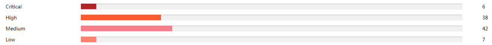
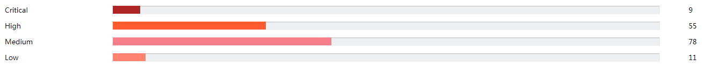

## 最小化安装
仅安装业务运行必需的系统组件，减少系统潜在安全风险，降低安全补丁的测试、升级、维护成本。
<br><br>
### 对比分析
安装包数量对比:
* 最小化安装环境
```
SUSE12-2-MinOS:~ # rpm -qa | wc -l
797
```
* 非最小化安装环境
```
NKG1000115469:~ # rpm -qa | wc -l
1754
```
Nessus扫描结果对比:
* 最小化安装环境
 
* 非最小化安装环境
 

可见操作系统最小化安装可以大幅降低系统默认安装包数量，减少Nessus扫描安全漏洞数量。

### 如何实施
* 卸载无用组件, 如桌面环境等
```
NKG1000115469:~ # rpm -qa | grep -iE "(xorg)|(gnome)|(kde)|(x11)|(gtk)"
xorg-x11-libs-7.6-45.14.noarch
xorg-x11-fonts-core-7.6-29.45.noarch
xorg-x11-server-7.6_1.18.3-57.34.x86_64
libgnome-keyring0-3.12.0-4.3.x86_64
gnome-shell-extensions-common-3.20.1-24.17.5.noarch
gtk3-data-3.20.9-11.2.noarch
gtk2-engine-hcengine-2.20.2-19.22.x86_64
......
xorg-x11-fonts-7.6-29.45.noarch
gnome-system-monitor-3.20.1-4.5.x86_64
gnome-shell-extensions-common-lang-3.20.1-24.17.5.noarch
xorg-x11-driver-video-7.6_1-14.30.x86_64
NKG1000115469:~ #
```
* 卸载不安全组件, 如telnet、rsh、nis等
```
NKG1000115469:~ # rpm -qa | grep -iE "(rsh)|(telnet)|(ypbind)|(ypserv)|(talk)|(tcpdump)|(netcat)|(ftp)"
ypbind-1.37.2-5.8.x86_64
rsh-0.17-731.12.x86_64
tcpdump-4.5.1-10.1.x86_64
netcat-openbsd-1.89-91.69.x86_64
vsftpd-3.0.2-31.1.x86_64
yast2-ftp-server-3.1.9-10.6.noarch
telnet-1.2-165.63.x86_64
yast2-tftp-server-3.1.3-5.5.noarch
NKG1000115469:~ #
```
### Tips
* 查看rpm信息, 判断是否有用
```
NKG1000115469:~ # rpm -qi gtk3-tools
Name        : gtk3-tools
Version     : 3.20.9
Release     : 11.2
Architecture: x86_64
Install Date: Tue Apr 25 12:43:01 2017
Group       : System/Libraries
Size        : 301272
License     : LGPL-2.1+
Signature   : RSA/SHA256, Sat Oct 15 01:32:34 2016, Key ID 70af9e8139db7c82
Source RPM  : gtk3-3.20.9-11.2.src.rpm
Build Date  : Sat Oct 15 01:30:08 2016
Build Host  : sheep26
Relocations : (not relocatable)
Packager    : https://www.suse.com/
Vendor      : SUSE LLC <https://www.suse.com/>
URL         : http://www.gtk.org/
Summary     : The GTK+ toolkit library (version 3) -- Tools
Description :
GTK+ is a multi-platform toolkit for creating graphical user interfaces.
Offering a complete set of widgets, GTK+ is suitable for projects
ranging from small one-off projects to complete application suites.
Distribution: SUSE Linux Enterprise 12
NKG1000115469:~ #
```
* 查看rpm提供哪些文件(工具/命令/库), 判断是否有用
```
NKG1000115469:~ # rpm -ql gtk3-tools
/etc/alternatives/gtk-update-icon-cache
/etc/alternatives/gtk-update-icon-cache.1.gz
/usr/bin/broadwayd
/usr/bin/gtk-builder-tool
/usr/bin/gtk-encode-symbolic-svg
/usr/bin/gtk-launch
/usr/bin/gtk-query-immodules-3.0-64
/usr/bin/gtk-query-settings
/usr/bin/gtk-update-icon-cache
/usr/bin/gtk-update-icon-cache-3.0
/usr/bin/gtk3-icon-browser
/usr/share/applications/gtk3-icon-browser.desktop
/usr/share/man/man1/broadwayd.1.gz
/usr/share/man/man1/gtk-builder-tool.1.gz
NKG1000115469:~ #
```
