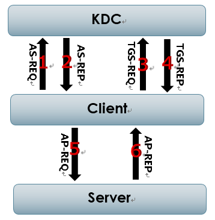
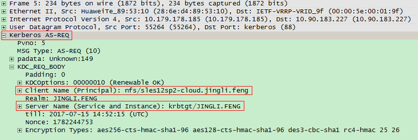
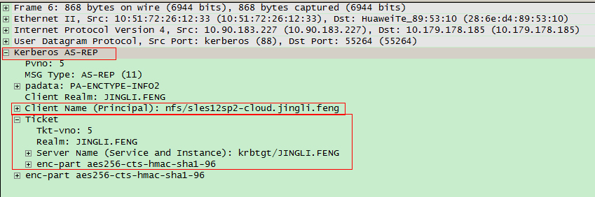
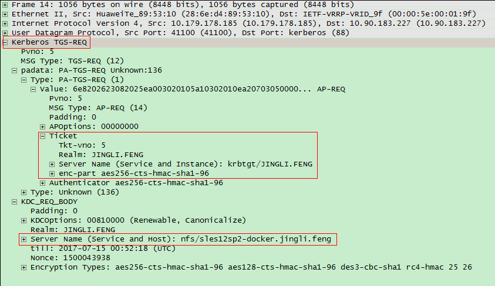
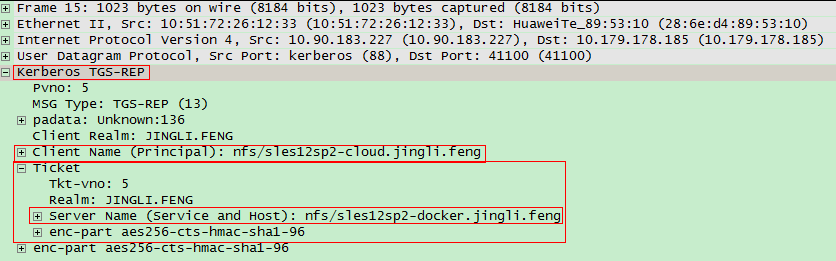
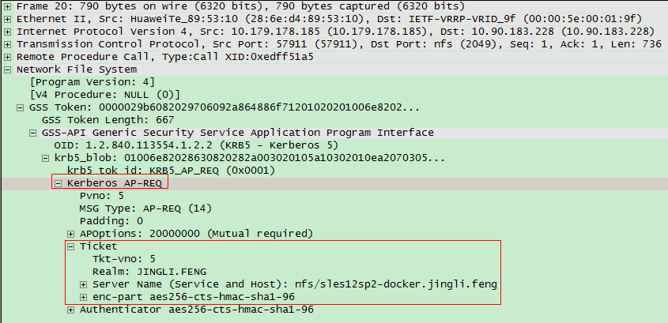
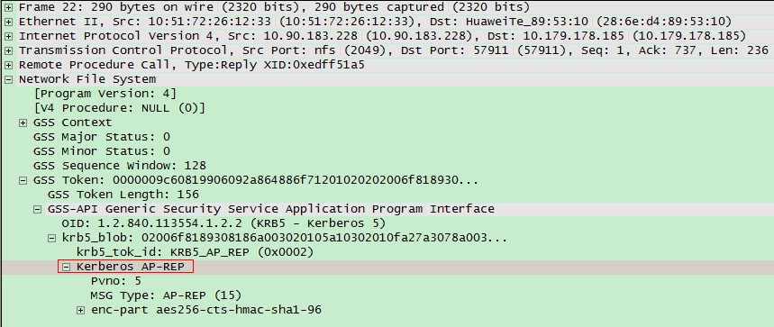

## Kerberos认证流程
* 1 - Client向KDC申请TGT(Ticket Granting Ticket)
* 2 - Client通过得到的TGT向KDC申请用于访问Server的Ticket
* 3 - Client向Server提交Ticket完成认证

### 三个子协议
* 1 - Authentication Service Exchange
>AS-REQ
>AS-REP
* 2 - Ticket Granting Service Exchange
>TGS-REQ
>TGS-REP
* 3 - Client/Server Exchange
>AP-REQ
>AP-REP

### 认证流程
* 1 - AS-REQ

Client向KDC(Authentication Service)发送AS-REQ请求，请求对krbtgt(Ticket Granting Service)的访问。
 

* 2 - AS-REP

KDC完成对Client的认证，并将一个可以访问krbtgt的Ticket(TGS)返回给Client。
 

* 3 - TGS-REQ

Client携带第2步获取的Ticket(TGS)向KDC发送TGS-REQ消息，请求对nfs/sles12sp2-docker.jingli.feng(NFS Server)的访问。
 

* 4 - TGS-REP

KDC完成对Ticket(TGS)的校验后，通过Client的请求，并将一个可以访问nfs/sles12sp2-docker.jingli.feng(NFS Server)的Ticket(NFS Server)返回给Client。
 

* 5 - AP-REQ

Client携带第4步中获取的Ticket(NFS Server)向Server端(NFS Server)发送AP-REQ消息，请求访问Server提供的服务(NFS )。
 

* 6 - AP-REP

Server端(NFS Server)完成对Ticket(NFS Server)的校验后，允许Client的访问，并向Client返回一个AP-REP消息。
 

