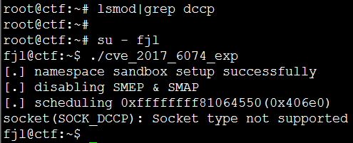

## 内核安全
Linux内核是操作系统的重要组成部分，是系统上层服务运行的基础，[升级内核补丁](update_security_patch.md)、调整内核参数对提升系统整体安全性有重要意义。

### 内核参数调整
```
SUSE12-2-MinOS:~ # vi /etc/sysctl.conf
# ......
# 禁止IP转发功能
net.ipv4.ip_forward = 0

# 禁止系统响应ICMP ECHO 和 TIMESTAMP广播请求, 防止广播风暴
net.ipv4.icmp_echo_ignore_broadcasts = 1

# 禁止转发源路由包, 防止内部网络被探测
net.ipv4.conf.all.arp_filter = 0
net.ipv4.conf.default.arp_filter = 0

# 禁止接收ICMP重定向消息, 避免主机路由表被恶意修改
net.ipv4.conf.all.accept_redirects = 0
net.ipv4.conf.default.accept_redirects = 0

# 禁止转发ICMP重定向消息, 避免主机路由表被恶意修改
net.ipv4.conf.all.send_redirects = 0
net.ipv4.conf.default.send_redirects = 0

# 只接收来自默认网关的ICMP重定向消息, 防止ARP跨网段欺骗
net.ipv4.conf.all.secure_redirects = 1
net.ipv4.conf.default.secure_redirects = 1

# 开启反向路径过滤, 防止IP欺骗, 要求接收的数据包和返回的数据包必须通过同一个接口
net.ipv4.conf.all.rp_filter = 1
net.ipv4.conf.default.rp_filter = 1

# 记录欺骗、源路由和重定向包
net.ipv4.conf.all.log_martians = 1
net.ipv4.conf.default.log_martians = 1

# 关闭tcp_timestamps支持, 预防拒绝服务攻击
net.ipv4.tcp_timestamps = 0

# 开启恶意ICMP错误消息保护
net.ipv4.icmp_ignore_bogus_error_responses = 1

# 设置客户端等候确认的连接数, 预防SYN Flooding攻击
net.ipv4.tcp_max_syn_backlog = 4096

# 开启SYN cookies功能, 预防SYN Flooding攻击
net.ipv4.tcp_syncookies = 1

# 设置TCP连接等待超时时间, 预防拒绝服务攻击
net.ipv4.tcp_fin_timeout = 60

# 禁止接收源路由包
net.ipv4.conf.all.accept_source_route = 0
net.ipv4.conf.default.accept_source_route = 0

# 禁用ARP代理功能
net.ipv4.conf.all.proxy_arp = 0
net.ipv4.conf.default.proxy_arp = 0

# 禁用SysRq功能
kernel.sysrq = 0

# 开启内存地址随机化, 预防缓冲区溢出攻击
kernel.randomize_va_space = 2

# 禁用IPv6
net.ipv6.conf.all.disable_ipv6 = 1
net.ipv6.conf.default.disable_ipv6 = 1
# ......
SUSE12-2-MinOS:~ # 
SUSE12-2-MinOS:~ # sysctl -p    //使配置参数生效
```
更多参考:
[sysctl-networking](sysctl-networking.txt)
[sysctl-kernel](sysctl-kernel.txt)
### 内核模块
使用`lsmod`查看系统已加载的内核模块:
```
SUSE12-2-MinOS:~ # lsmod
Module                  Size  Used by
cifs                  692224  2 
dns_resolver           16384  1 cifs
fscache                77824  1 cifs
iptable_nat            16384  1 
iptable_filter         16384  1 
ip_tables              24576  2 iptable_filter,iptable_nat
bridge                139264  1 br_netfilter
stp                    16384  1 bridge
# ......
#
joydev                 20480  0 
processor              40960  1 acpi_cpufreq
nfsd                  352256  9 
nfs_acl                16384  1 nfsd
btrfs                1097728  1 
sr_mod                 24576  0 
cdrom                  61440  1 sr_mod
SUSE12-2-MinOS:~ # 
```
对于使用不到的内核模块可以将其卸载并禁用，以降低系统安全风险:
例如利用DCCP模块漏洞([Linux kernel: CVE-2017-6074: DCCP double-free vulnerability](https://nvd.nist.gov/vuln/detail/CVE-2017-6074))实现本地提权到root用户: 
```
root@ctf:~# lsmod | grep dccp  //查看是否加载了dccp模块
dccp_ipv6              20480  62
dccp_ipv4              20480  7 dccp_ipv6
dccp                   73728  2 dccp_ipv6,dccp_ipv4
root@ctf:~#  su - fjl
fjl@ctf:~$ id
uid=1000(fjl) gid=1000(fjl) groups=1000(fjl),4(adm),27(sudo)
fjl@ctf:~$ whoami
fjl
fjl@ctf:~$ gcc -o cve_2017_6074_exp cve_2017_6074_exp.c 
fjl@ctf:~$ 
fjl@ctf:~$ ./cve_2017_6074_exp
[.] namespace sandbox setup successfully
[.] disabling SMEP & SMAP
[.] scheduling 0xffffffff81064550(0x406e0)
[.] waiting for the timer to execute
[.] done
[.] SMEP & SMAP should be off now
[.] getting root
[.] executing 0x555fad37d132
[.] done
[.] should be root now
[.] checking if we got root
[+] got r00t ^_^
[!] don't kill the exploit binary, the kernel will crash
bash: /root/.bashrc: Permission denied
root@ctf:/home/fjl# id
uid=0(root) gid=0(root) groups=0(root),65534(nogroup)
root@ctf:/home/fjl# whoami
root
root@ctf:/home/fjl#
```


对于上面这个安全漏洞，如果我们将DCCP模块卸载并禁用掉，则可规避该安全风险。
如下卸载DCCP模块后，漏洞不可利用:
```
root@ctf:~# lsmod|grep dccp
root@ctf:~# 
root@ctf:~# su - fjl
fjl@ctf:~$ ./cve_2017_6074_exp
[.] namespace sandbox setup successfully
[.] disabling SMEP & SMAP
[.] scheduling 0xffffffff81064550(0x406e0)
socket(SOCK_DCCP): Socket type not supported
fjl@ctf:~$ 
```


卸载&禁用内核模块方法:
* 卸载
使用`rmmod`或者`modprobe -r`可以卸载已加载的内核模块，如果内核模板被占用(in use)，则需禁用后重启系统。
```
root@ctf:~# lsmod | grep dccp
dccp                   73728  0
root@ctf:~# rmmod dccp    //使用rmmod卸载内核模块
root@ctf:~# lsmod | grep dccp
root@ctf:~#
root@ctf:~# lsmod | grep dccp
dccp                   73728  0
root@ctf:~# modprobe -r dccp    //使用modprobe卸载内核模块
root@ctf:~# lsmod | grep dccp
root@ctf:~#
```

* 禁用
在/etc/modprobe.d/目录下的任意以.conf结尾的文件中添加:
`install <module-name> /bin/true`
例如:
```
root@ctf:~# cat /etc/modprobe.d/dccp-disable.conf
install dccp_ipv6 /bin/true
install dccp_ipv4 /bin/true
install dccp /bin/true
root@ctf:~#
```

* 删除
最干净的做法就是将不会用到的内核模块从服务器上移除:
```
root@ctf:~# find /lib/modules -type f -name "dccp.ko" -print
/lib/modules/4.8.0-22-generic/kernel/net/dccp/dccp.ko
root@ctf:~# 
root@ctf:~# rm /lib/modules/4.8.0-22-generic/kernel/net/dccp/dccp.ko
root@ctf:~# 
root@ctf:~# ls -l /lib/modules/4.8.0-22-generic/kernel/net/dccp/dccp.ko
ls: cannot access '/lib/modules/4.8.0-22-generic/kernel/net/dccp/dccp.ko': No such file or directory
root@ctf:~# 
root@ctf:~# lsmod | grep dccp
root@ctf:~# modprobe -i dccp
modprobe: ERROR: could not insert 'dccp': Unknown symbol in module, or unknown parameter (see dmesg)
root@ctf:~# 
```

一些不常用的内核模块:
dccp, sctp, rds, tipc, cramfs, freevxfs, jffs2, hfs, hfsplus, squashfs, udf, vfat, usb-storage

### 内核Rootkit
Rootkit是一套由入侵者留在系统中的后门程序。Rootkit通常只有在系统已经被侵入并且获得root权限后才被安装进系统，并帮助入侵者长期控制系统，搜集主机和网络信息，并隐藏入侵者的痕迹。
rootkit示例，可以实现隐藏文件、隐藏进程、提权到root:
```
root@suse:~ # insmod /opt/rootkit-sample.ko  //加载rootkit内核模块
root@suse:~ # lsmod | grep rootkit  //使用lsmod查看不到
root@suse:~ # 
root@suse:~ # cat /proc/rtkit    //rootkit使用帮助
rootkit-sample

Commands:
hm   : hide module
sm   : not hide module
hf   : hide file
sf   : not hide file
hp   : hide process
sp   : not hide process
hf-X : hide file /X
sf-X : not hide file /X
hp-X : hide process with pid X
sp-X : not hide process with pid X

Status:
hide module  : 1
hide file    : 1
hide process : 1
root@suse:~ # su - foo
foo@suse:~> 
foo@suse:~> id
uid=1000(foo) gid=100(users) groups=100(users),16(dialout),33(video)
foo@suse:~> 
foo@suse:~> echo "31415926" > /proc/rtkit   //直接提权到root用户
foo@suse:~> id
uid=0(root) gid=0(root) groups=0(root),16(dialout),33(video),100(users)
foo@suse:~> ps -ef|grep "sbin/sshd" | grep -v grep
root      3431     1  0 Jun28 ?        00:00:00 /usr/sbin/sshd -o PidFile=/var/run/sshd.init.pid
foo@suse:~> echo "hp-3431" > /proc/rtkit    //隐藏pid=3431的进程
foo@suse:~> ps -ef|grep "sbin/sshd" | grep -v grep
foo@suse:~> 
foo@suse:~> echo "sp-3431" > /proc/rtkit    //不隐藏pid=3431的进程
foo@suse:~> ps -ef|grep "sbin/sshd" | grep -v grep
root      3431     1  0 Jun28 ?        00:00:00 /usr/sbin/sshd -o PidFile=/var/run/sshd.init.pid
foo@suse:~> 
```
Rootkit检测工具:
* [Rootkit Hunter](http://rkhunter.sourceforge.net/)
* [Chkrootkit](http://www.chkrootkit.org/)

### 其他内核增强技术
* [KPatch](https://en.wikipedia.org/wiki/Kpatch)
* [KGraft](https://en.wikipedia.org/wiki/KGraft)
* [SELinux](https://en.wikipedia.org/wiki/Security-Enhanced_Linux)
* [AppArmor](https://en.wikipedia.org/wiki/AppArmor)
* [GRSecurity](https://en.wikipedia.org/wiki/Grsecurity)