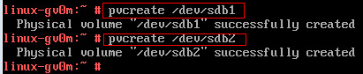
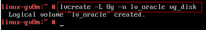
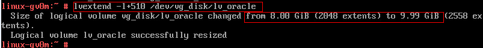
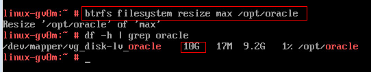

## LVM磁盘管理
使用LVM进行磁盘管理, 可以很方便的进行分区以及扩容等。

### 1. LVM磁盘管理流程

图1: LVM磁盘管理分区过程
#### 1.1 物理磁盘
硬盘1：60G

图2: 磁盘1
 
硬盘2：10G

图3: 磁盘2
 
使用`fdisk -l`可以看到系统内的磁盘:

图4: fdisk -l执行结果
#### 1.2 物理分区
图4中，/dev/sda磁盘已经分为三个分区：/dev/sda1、/dev/sda2、/dev/sda3
下面将/dev/sdb磁盘分为两个分区：/dev/sdb1(5G)、/dev/sdb2(5G)
执行：
`fdisk /dev/sdb`
根据下图5一步一步操作:

图5: fdisk物理分区过程
 
再次使用`fdisk -l`查看系统分区，可以看到/dev/sdb磁盘已经被分为/dev/sdb1和/dev/sdb2两个分区:

图6: fdisk -l执行结果
#### 1.3 创建物理卷/PV
物理分区划分完之后，可以使用`pvcreate`创建物理卷，物理卷由物理分区创建而来，只是在物理分区内划分了一块特殊的区域用于存储LVM相关参数。

图7: pvcreate创建物理卷
 
可以使用`pvdisplay`查看系统内的物理卷:

图8: pvdisplay查看物理卷
#### 1.4 创建卷组/VG
卷组是一个或者多个物理卷的组合，卷组将多个物理卷组合在一起，形成一个可管理的单元。卷组类似于非LVM系统中的物理硬盘。
可以使用vgcreate命令创建卷组，创建后可以使用vgdisplay查看:

图9: 创建&查看卷组
#### 1.5 创建逻辑卷/LV
逻辑卷是在卷组中划分的一个逻辑区域，类似于非LVM系统中的硬盘分区。
可以使用`lvcreate`命令创建逻辑卷，创建后可以使用`lvdisplay`查看:

图10: 创建逻辑卷
 

图11: 查看逻辑卷
#### 1.6 创建文件系统
逻辑卷创建完成之后，可以使用`mkfs`来创建文件系统。

图12: 创建文件系统
#### 1.7 挂载分区
使用`mount`命令可以将创建的文件系统挂载到指定的目录。

图13: 挂载分区
 
同时需编辑/etc/fstab文件，添加:
`/dev/vg_disk/lv_oracle	/opt/oracle	btrfs		defaults		0  0`
使系统重启时可以自动挂载。
### 2. 分区扩展
LVM可以动态调整分区大小，无须重新启动机器。
假设逻辑卷/dev/vg_disk/lv_oracle空间不足，想要进行扩展。
#### 2.1 逻辑卷所在的卷组有剩余空间
* 查看卷组剩余空间

图14: 查看卷组剩余空间
 
可以看到vg_disk卷组还有2G剩余空间。
* 扩展逻辑卷
使用`lvextend`命令进行扩展:

图15: 扩展逻辑卷
 
* 修改文件系统大小

图16: 修改文件系统大小
 
可以看到/opt/oracle的空间已经从原来的8G变为10G。
说明：
文件系统类型不同，resize命令可能不同，例如，ext2/3/4需使用resize2fs命令。
#### 2.2 逻辑卷所在的卷组没有剩余空间
如果卷组中没有剩余空间，则必须先向卷组内添加物理卷，物理卷添加后，即可按照2.1节进行扩展逻辑卷。
* pvdisplay查看系统内空闲的物理卷

图17: 查看物理卷剩余空间
 
* vgextend扩展卷组

图18: 扩展卷组
 
* 按照2.1节扩展逻辑卷