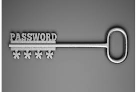

## 用户口令安全
口令是Linux服务器上最常用的用户认证凭证，用户口令一旦泄露或被猜解将严重威胁服务器的安全。
<br>

### 设置口令有效期
定期修改用户密码是个很好的习惯，防止用户长期使用一个密码，增加口令被暴力破解成功的风险。
* 新增用户

file: /etc/login.defs
```
#
# Password aging controls:
#
#	PASS_MAX_DAYS	Maximum number of days a password may be used.
#	PASS_MIN_DAYS	Minimum number of days allowed between password changes.
#	PASS_WARN_AGE	Number of days warning given before a password expires.
#
PASS_MAX_DAYS	90
PASS_MIN_DAYS	7
PASS_WARN_AGE	7
```
* 现有用户

```
NKG1000115469:~ # chage -l foo    //使用chage -l查看
Last password change				: Sep 06, 2017
Password expires					: never
Password inactive				   : never
Account expires				     : never
Minimum number of days between password change		: 0
Maximum number of days between password change		: 99999
Number of days of warning before password expires	 : 7
NKG1000115469:~ #
NKG1000115469:~ # chage -M 90 -m 7 -W 10 foo   //使用chage修改用户口令有效期
NKG1000115469:~ # 
NKG1000115469:~ # chage -l foo
Last password change				: Sep 06, 2017
Password expires					: Dec 05, 2017
Password inactive				   : never
Account expires				     : never
Minimum number of days between password change		: 7    //-m
Maximum number of days between password change		: 90   //-M
Number of days of warning before password expires	 : 10   //-W
NKG1000115469:~ #
NKG1000115469:~ # grep foo /etc/shadow
foo:<password>:17415:7:90:10:::
NKG1000115469:~ #
```

### 强制用户修改初始密码
```
NKG1000115469:~ # chage -d 0 foo    //强制用户下次登录系统时修改密码
NKG1000115469:~ # chage -l foo
Last password change				: password must be changed
Password expires					: password must be changed
Password inactive				   : password must be changed
Account expires					 : never
Minimum number of days between password change		: 7
Maximum number of days between password change		: 90
Number of days of warning before password expires	 : 10
NKG1000115469:~ # ssh foo@localhost
Password: 
You are required to change your password immediately (root enforced)
Changing password for foo.
(current) UNIX password:
```
### 口令加密算法
口令加密算法一般使用不可逆的HASH算法，但使用不安全的HASH算法加密的口令很容易被破解。
<br>
Linux系统上口令加密通常使用两个PAM模块，pam_unix.so或pam_unix2.so。
* pam_unix

在`/etc/login.defs`文件中配置:
```
ENCRYPT_METHOD SHA512
```
或者在`/etc/pam.d/common-password`文件中配置:
```
password	sufficient	pam_unix.so	use_authtok shadow try_first_pass sha512
```
* pam_unix2

在`/etc/default/passwd`文件中配置:
```
CRYPT_FILES=sha512
```
* 加密算法判断

根据`/etc/shadow`文件中的第2个域判断:
```
foo:$6$xxx:0:7:90:10:::
```
|示例|算法|
|----|----|
|$6$xxx|sha512|
|$5$xxx|sha256|
|$2y$xxx|blowfish|
|$1$xxx|md5|
|xxxxxx|des|
安全性从上到下依次降低。

### 口令复杂度校验
设置强口令、增加口令复杂度，可降低口令被破解的可能性。
<br>
Linux系统上口令复杂度校验通常使用两个PAM模块，pam_cracklib.so(常用)或pam_pwcheck.so。
* pam_cracklib

示例: 最小长度14，至少包含4种字符(大写、小写、数字、特殊字符)，禁止包含用户名，对root用户生效
```
SUSE12-2:~ # cat /etc/pam.d/common-password
#%PAM-1.0
#
password	requisite	pam_cracklib.so minlen=14 minclass=4 reject_username enforce_for_root
password	sufficient	pam_unix.so	use_authtok shadow try_first_pass sha512
```
pam_cracklib.so模块常用参数:

|参数|作用|
|----|----|
|difok=N|新密码和旧密码至少有几个字符不同, 默认值:5|
|minlen=N|密码最小长度, 默认值:9|
|dcredit=N|N>=0时表示密码中最多包含N个数字; N<0时表示密码中至少包含-N个数字|
|ucredit=N|大写字母个数要求，N同dcredit|
|lcredit=N|小写字母个数要求，N同dcredit|
|ocredit=N|特殊字符个数要求，N同dcredit|
|minclass=N|密码中至少包含几种字符|
|maxrepeat=N|相同字符连续重复(aaa)最大次数，默认值:0，表示不检查|
|maxsequence=N|字符序列(abcd,1234)最大长度，默认值:0，表示不检查|
|reject_username|禁止包含用户名或逆序|
|enforce_for_root|口令复杂度要求对root用户也生效|
|dictpath=/path/to/dict|口令字典路径，禁止新密码与字典内的口令相同|
更多参考`man pam_cracklib`。

* pam_pwcheck

示例: 最小长度14，记录10个历史密码，对root用户生效
```
SUSE11-3:~ # cat /etc/pam.d/common-password
#%PAM-1.0
#
password	requisite	pam_pwcheck.so minlen=14 remember=10 enforce_for_root
password	required	pam_unix2.so use_authtok
```
pam_pwcheck.so模块常用参数:

|参数|作用|
|----|----|
|minlen=N|密码最小长度, 默认值:5|
|remember=N|记录历史密码个数，禁止使用这些历史密码|
|enforce_for_root|口令复杂度要求对root用户也生效|
更多参考`man pam_cracklib`。

### 限制使用历史密码
限制使用历史密码，避免用户一直使用重复的密码，降低口令被猜解的可能性。
<br>
Linux系统上可以利用pam_pwhistory(常用)或pam_pwcheck模块实现该约束。
* pam_pwhistory

示例: 记录10个历史密码，对root用户生效
```
SUSE12-2:~ # cat /etc/pam.d/common-password
#%PAM-1.0
#
password	requisite	pam_cracklib.so minlen=14 minclass=4 reject_username enforce_for_root
password	required	pam_pwhistory.so use_authtok remember=10 enforce_for_root
password	sufficient	pam_unix.so	use_authtok shadow try_first_pass sha512
```
更多参考`man pam_pwhistory`。
