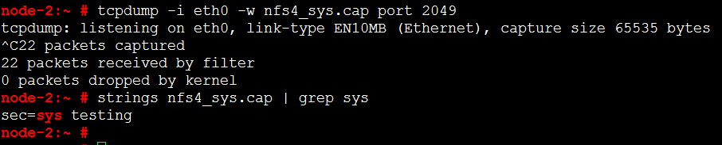
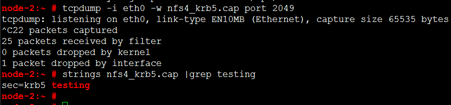
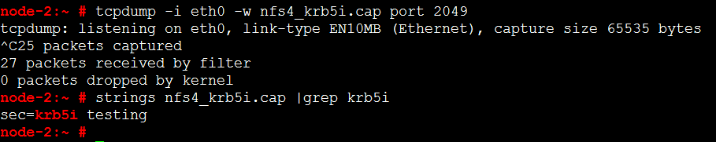
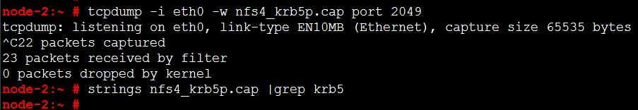

## NFS服务Kerberos认证
NFS(Network File System)服务是目前Linux操作系统上最常用的文件共享服务，通常运行在文件服务器上。
<br>
一般情况下NFS服务使用明文传输、且只能进行IP认证，可使用Kerberos服务增强认证、保证数据完整性和机密性。
<br>

<br>
[Kerberos认证流程](kerberos_auth_flow.md)

### Kerberos Server
OS: SUSE Linux Enterprise Server 12 SP2
<br>
IP: 192.168.1.10
<br>
FQDN：sles12sp2-selinux.jingli.feng
#### 1.1 hosts
```
SUSE12-2-MinOS:~ # hostname
SUSE12-2-MinOS
SUSE12-2-MinOS:~ # grep "192.168.1.10" /etc/hosts
192.168.1.10      sles12sp2-selinux.jingli.feng    SUSE12-2-MinOS
SUSE12-2-MinOS:~ #
```
#### 1.2 krb5.conf
krb5.conf为Kerberos程序（服务器&客户端）的主要配置文件。
```
SUSE12-2-MinOS:~ # cat /etc/krb5.conf 
[libdefaults]
    default_realm = JINGLI.FENG

[domain_realm]
    .jingli.feng = JINGLI.FENG
    jingli.feng = JINGLI.FENG

[logging]
    kdc = FILE:/var/log/krb5/krb5kdc.log
    admin_server = FILE:/var/log/krb5/kadmind.log
    default = SYSLOG:NOTICE:DAEMON

[realms]
    JINGLI.FENG = {
	kdc = 192.168.1.10
	admin_server = 192.168.1.10
    default_domain = jingli.feng
}
SUSE12-2-MinOS:~ #
```
#### 1.3 kdc.conf
kdc.conf为KDC（Key Distribution Center）配置文件（krb5kdc和kadmind服务）。
```
SUSE12-2-MinOS:~ # cat /var/lib/kerberos/krb5kdc/kdc.conf 
[kdcdefaults]
	kdc_ports = 750,88

[realms]
	JINGLI.FENG = {
		database_name = /var/lib/kerberos/krb5kdc/principal
		admin_keytab = FILE:/var/lib/kerberos/krb5kdc/kadm5.keytab
		acl_file = /var/lib/kerberos/krb5kdc/kadm5.acl
        dict_file = /var/lib/kerberos/krb5kdc/kadm5.dict
		key_stash_file = /var/lib/kerberos/krb5kdc/.k5.JINGLI.FENG
		kdc_ports = 750,88
		max_life = 10h 0m 0s
		max_renewable_life = 7d 0h 0m 0s
	}

[logging]
    kdc = FILE:/var/log/krb5/krb5kdc.log
    admin_server = FILE:/var/log/krb5/kadmind.log
SUSE12-2-MinOS:~ #
```
#### 1.4 Create Prinicipal Database
```
SUSE12-2-MinOS:~ # kdb5_util create -s
Loading random data
Initializing database '/var/lib/kerberos/krb5kdc/principal' for realm 'JINGLI.FENG',
master key name 'K/M@JINGLI.FENG'
You will be prompted for the database Master Password.
It is important that you NOT FORGET this password.
Enter KDC database master key: <输入一串字符作为master key>
Re-enter KDC database master key to verify: <重复输入上面的字符串>
SUSE12-2-MinOS:~ #
SUSE12-2-MinOS:~ # klist -l /var/lib/kerberos/krb5kdc/principal
Principal name                 Cache name
--------------                 ----------
root/admin@JINGLI.FENG         DIR::/run/user/0/krb5cc/tkt
SUSE12-2-MinOS:~ #
```
#### 1.5 Set ACL for Admin Server
设置Principal用于远程访问krb5kdc & kadmind服务。
```
SUSE12-2-MinOS:~ # cat /var/lib/kerberos/krb5kdc/kadm5.acl 
root/admin@JINGLI.FENG  *
SUSE12-2-MinOS:~ #
```
#### 1.6 Create Administrator User
在database内创建1.4节配置的Principal 。
```
SUSE12-2-MinOS:~ # kadmin.local 
Authenticating as principal root/admin@JINGLI.FENG with password.
kadmin.local:  addprinc root/admin
WARNING: no policy specified for root/admin@JINGLI.FENG; defaulting to no policy
Enter password for principal "root/admin@JINGLI.FENG": <输入密码>
Re-enter password for principal "root/admin@JINGLI.FENG": <重复密码>
Principal "root/admin@JINGLI.FENG" created.
kadmin.local:  listprincs
K/M@JINGLI.FENG
kadmin/admin@JINGLI.FENG
kadmin/changepw@JINGLI.FENG
kadmin/sles12sp2-selinux.jingli.feng@JINGLI.FENG
krbtgt/JINGLI.FENG@JINGLI.FENG
root/admin@JINGLI.FENG
kadmin.local:  quit
SUSE12-2-MinOS:~ #
```
#### 1.7 Start KDC and Admin Service
```
SUSE12-2-MinOS:~ # systemctl start krb5kdc.service
SUSE12-2-MinOS:~ # systemctl start kadmind.service
```
#### 1.8 Testing KDC and KAdmin
使用kinit测试krb5kdc服务:
```
SUSE12-2-MinOS:~ # kinit root/admin
Password for root/admin@JINGLI.FENG:<输入1.6节设置的密码>
SUSE12-2-MinOS:~ # 
```
使用kadmin测试kadmind服务:
```
SUSE12-2-MinOS:~ # kadmin -p root/admin
Authenticating as principal root/admin with password.
Password for root/admin@JINGLI.FENG:<输入1.6节设置的密码>
kadmin:
SUSE12-2-MinOS:~ # 
```
### NFS Server
OS: SUSE Linux Enterprise Server 12 SP2
<br>
IP: 192.168.1.20
<br>
FQDN: sles12sp2-docker.jingli.feng
#### 2.1 hosts
```
SLES12-2:~ #  cat /etc/hosts
192.168.1.10	sles12sp2-selinux.jingli.feng   sles12sp2_selinux
192.168.1.20	sles12sp2-docker.jingli.feng  sles12sp2_docker
192.168.1.30	sles12sp2-cloud.jingli.feng   sles12sp2_cloud
```
【注意】
<br>
此文件中配置的kerberos server、nfs server、nfs client主机别名的第一项必须是主机的FQDN。
#### 2.2 krb5.conf
将Kerberos Server上配置的krb5.conf文件复制一份到NFS Server上。
```
SLES12-2:~ # mv /etc/krb5.conf /etc/krb5.conf.bak
SLES12-2:~ # scp sles12sp2-selinux.jingli.feng:/etc/krb5.conf /etc/krb5.conf
```
#### 2.3 Create Principal for NFS Server
```
SLES12-2:~ # kadmin -p root/admin    //连接远程kadmind服务
Authenticating as principal root/admin with password.
Password for root/admin@JINGLI.FENG: <输入密码>
kadmin:  addprinc -randkey nfs/sles12sp2-docker.jingli.feng
WARNING: no policy specified for nfs/sles12sp2-docker.jingli.feng@JINGLI.FENG; defaulting to no policy
Principal "nfs/sles12sp2-docker.jingli.feng@JINGLI.FENG" created.
kadmin:  ktadd -k /etc/krb5.keytab nfs/sles12sp2-docker.jingli.feng
Entry for principal nfs/sles12sp2-docker.jingli.feng with kvno 2, encryption type aes256-cts-hmac-sha1-96 added to keytab WRFILE:/etc/krb5.keytab.
Entry for principal nfs/sles12sp2-docker.jingli.feng with kvno 2, encryption type aes128-cts-hmac-sha1-96 added to keytab WRFILE:/etc/krb5.keytab.
Entry for principal nfs/sles12sp2-docker.jingli.feng with kvno 2, encryption type des3-cbc-sha1 added to keytab WRFILE:/etc/krb5.keytab.
Entry for principal nfs/sles12sp2-docker.jingli.feng with kvno 2, encryption type arcfour-hmac added to keytab WRFILE:/etc/krb5.keytab.
kadmin:  listprincs
K/M@JINGLI.FENG
kadmin/admin@JINGLI.FENG
kadmin/changepw@JINGLI.FENG
kadmin/sles12sp2-selinux.jingli.feng@JINGLI.FENG
krbtgt/JINGLI.FENG@JINGLI.FENG
nfs/sles12sp2-docker.jingli.feng@JINGLI.FENG
root/admin@JINGLI.FENG
kadmin:  quit
SLES12-2:~ #
```
#### 2.4 idmapd.conf
Configuration file for libnfsidmap. Used by idmapd and svcgssd to map NFSv4 name to and from ids.
```
SLES12-2:~ # cat /etc/idmapd.conf 
[General]
Verbosity = 0
Pipefs-Directory = /var/lib/nfs/rpc_pipefs
Domain = jingli.feng
Local-Realms = JINGLI.FENG

[Mapping]
Nobody-User = nobody
Nobody-Group = nobody

SLES12-2:~ #
```
#### 2.5 Exporting
```
SLES12-2:~ # cat /etc/exports
/opt	*(rw,no_root_squash,sync,no_subtree_check,sec=krb5)
SLES12-2:~ #
```
sec参数可选值:

|value|state|
|-----|-----|
|sys|no cryptographic security(default)|
|krb5|authentication only|
|krb5i|authentication and integrity protection|
|krb5p|authentication, integrity and privacy protection|

sec参数可设置多个来支持多种方式（sec=krb5,sec=sys）。
#### 2.6 Start rpc.svcgssd and nfsserver Service
修改`/etc/sysconfig/nfs`文件，设置：`NFS_SECURITY_GSS="yes"`
```
SLES12-2:~ # systemctl start rpc-svcgssd.service
SLES12-2:~ # systemctl start nfsserver.service
```
### NFS Client
OS: SUSE Linux Enterprise Server 12 SP 2
<br>
IP: 192.168.1.30
<br>
FQDN: sles12sp2-cloud.jingli.feng
#### 3.1 hosts
```
NKG1000114607:~ #  cat /etc/hosts
192.168.1.10	sles12sp2-selinux.jingli.feng   sles12sp2_selinux
192.168.1.20	sles12sp2-docker.jingli.feng  sles12sp2_docker
192.168.1.30	sles12sp2-cloud.jingli.feng   sles12sp2_cloud
```
【注意】
此文件中配置的kerberos server、nfs server、nfs client主机别名的第一项必须是主机的FQDN。
#### 3.2 krb5.conf
将Kerberos Server上配置的krb5.conf文件复制一份到NFS Client上。
```
NKG1000114607:~ # mv /etc/krb5.conf /etc/krb5.conf.bak
NKG1000114607:~ # scp sles12sp2-selinux.jingli.feng:/etc/krb5.conf /etc/krb5.conf
```
#### 3.3 Create Principal for NFS Client
```
NKG1000114607:~ # kadmin -p root/admin
Authenticating as principal root/admin with password.
Password for root/admin@JINGLI.FENG: 
kadmin:  addprinc -randkey nfs/sles12sp2-cloud.jingli.feng
WARNING: no policy specified for nfs/sles12sp2-cloud.jingli.feng@JINGLI.FENG; defaulting to no policy
Principal "nfs/sles12sp2-cloud.jingli.feng@JINGLI.FENG" created.
kadmin:  ktadd -k /etc/krb5.keytab nfs/sles12sp2-cloud.jingli.feng
Entry for principal nfs/sles12sp2-cloud.jingli.feng with kvno 2, encryption type aes256-cts-hmac-sha1-96 added to keytab WRFILE:/etc/krb5.keytab.
Entry for principal nfs/sles12sp2-cloud.jingli.feng with kvno 2, encryption type aes128-cts-hmac-sha1-96 added to keytab WRFILE:/etc/krb5.keytab.
Entry for principal nfs/sles12sp2-cloud.jingli.feng with kvno 2, encryption type des3-cbc-sha1 added to keytab WRFILE:/etc/krb5.keytab.
Entry for principal nfs/sles12sp2-cloud.jingli.feng with kvno 2, encryption type arcfour-hmac added to keytab WRFILE:/etc/krb5.keytab.
kadmin:  listprincs
K/M@JINGLI.FENG
kadmin/admin@JINGLI.FENG
kadmin/changepw@JINGLI.FENG
kadmin/sles12sp2-selinux.jingli.feng@JINGLI.FENG
krbtgt/JINGLI.FENG@JINGLI.FENG
nfs/sles12sp2-cloud.jingli.feng@JINGLI.FENG
nfs/sles12sp2-docker.jingli.feng@JINGLI.FENG
root/admin@JINGLI.FENG
kadmin:  quit
NKG1000114607:~ #
```
#### 3.4 Start rpc.gssd Service
编辑`/etc/sysconfig/nfs`文件，设置：`GSSD_OPTIONS="-d /run/user/0/krb5cc/"`
```
NKG1000114607:~ # systemctl start rpc-gssd.service
```
#### 3.5 Mounting
```
NKG1000114607:~ # mount.nfs4 -o sec=krb5 sles12sp2_docker:/opt/ /opt/test
```
#### 3.6 Testing for sec
NFS Server抓包:
```
node-2:~ # tcpdump -i eth0 -w nfs4_sys.cap port 2049
tcpdump: listening on eth0, link-type EN10MB (Ethernet), capture size 65535 bytes
```
NFS Client 挂载并写数据:
```
NKG1000114607:~ # mount.nfs4 -o sec=sys sles12sp2_docker:/opt /opt/test
NKG1000114607:~ # 
NKG1000114607:~ # echo "sec=sys testing" > /opt/test/testfile
NKG1000114607:~ #
```
查看抓包结果:
```
node-2:~ # strings nfs4_sys.cap | grep sys
sec=sys testing
node-2:~ #
```
* sec=sys

* sec=krb5

* sec=krb5i

* sec=krb5p

