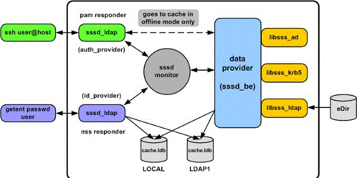
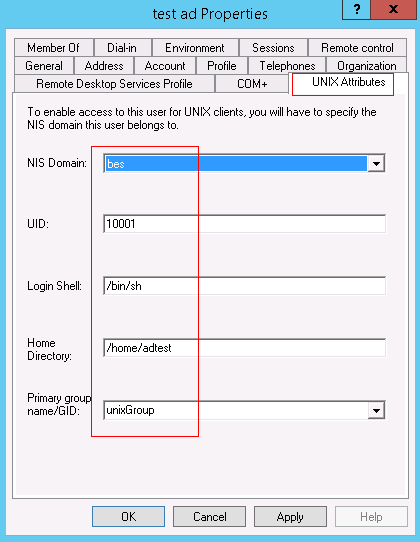

## SSSD
SSSD (System Security Services Daemon) 是一个框架，其本身不提供名称解析或认证功能，但可以与AD、LDAP、Kerberos进行对接，访问远程提供的名称解析或认证服务。
<br>

### AD集中认证
前提:
Windows AD Server, [安装AD DS](https://www.server-world.info/en/note?os=Windows_Server_2012&p=active_directory&f=1)， [创建DC](https://www.server-world.info/en/note?os=Windows_Server_2012&p=active_directory&f=2)， 安装NIS组件(Identity Management for UNIX)(若不安装该组件，则在sssd.conf中必须配置ldap_id_mapping=True)，[创建用户](https://www.server-world.info/en/note?os=Windows_Server_2012&p=active_directory&f=3)
<br>


编辑sssd服务配置文件:
```
root@suse:~ # cat /etc/sssd/sssd.conf
[sssd]
services = nss, pam    #nss:名称解析; pam:认证
domains = adserver1, adserver2    #可以配置多个AD Server

[nss]

[pam]

[domain/adserver1]  #通过LDAP
id_provider = ldap
auth_provider = ldap
ldap_uri = ldaps://10.10.10.10:636    #配置AD Server的IP地址，636端口为LDAPS协议

ldap_tls_reqcert = allow
ldap_tls_cacertdir = /etc/ldap.certs/
ldap_tls_cacert = /etc/ldap.certs/adserver1-ca.cer    #CA证书，需要从AD Server导出

#配置查询路径
ldap_search_base = dc=example,dc=com
ldap_user_search_base = cn=Users,dc=example,dc=com
ldap_group_search_base = cn=Users,dc=example,dc=com

#下面三行指定一个用户(AD上创建好的)，用于查询信息
ldap_default_bind_dn = cn=ad query user,cn=Users,dc=example,dc=com
ldap_default_authtok_type = password
ldap_default_authtok = <password of ad query user>

#如果windows server上没有安装NIS组件，则设置下面两行
#ldap_id_mapping = True
#ldap_schema = ad

ldap_schema = rfc2307bis

ldap_user_object_class = user
ldap_user_name = sAMAccountName
ldap_user_principal = userPrincipalName
ldap_user_home_directory = unixHomeDirectory

ldap_group_object_class = group
ldap_group_name = sAMAccountName

[domain/adserver2]  #通过LDAP+Kerberos
id_provider = ldap

auth_provider = krb5
krb5_server = bes.software.huawei
krb5_realm = BES.SOFTWARE.HUAWEI
ldap_force_upper_case_realm = true

ldap_uri = ldaps://20.20.20.20:636

ldap_tls_reqcert = allow
ldap_tls_cacertdir = /etc/ldap.certs/
ldap_tls_cacert = /etc/ldap.certs/adserver2-ca.cer

#剩余内容同[domain/adserver1]节

root@suse:~ #
root@suse:~ # systemctl restart sssd  //开启sssd服务
```

配置PAM:
```
root@suse:~ # pam-config  -a  --sss    //sss模块用于认证
root@suse:~ # pam-config  -a  --mkhomedir --mkhomedir-umask=0077    //自动为登录用户创建HOME目录
root@suse:~ #
```

配置NSS解析:
```
root@suse:~ # vi /etc/nsswitch.conf
passwd: compat sss   #添加sss
group:  compat sss   #添加sss
```

登录测试:
```
root@suse:~ # grep adtest /etc/passwd
root@suse:~ # 
root@suse:~ # ssh adtest@localhost
Password: 
Creating directory '/home/adtest'.
adtest@suse:/home/adtest> id
uid=10002(adtest) gid=10000(unixGroup) groups=10000(unixGroup)
adtest@suse:/home/adtest>
```

### More
更多参考请查看man帮助文档:
<br>
sssd, sssd.conf, sssd-ldap, sssd-krb5, sssd-simple, sssd-ipa, sssd-ad, sssd-sudo
