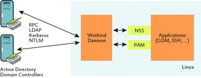

## Winbind
Winbind是Samba套件的功能之一。它允许Unix系统利用Windows NT的用户帐号信息。
<br>

### AD集中认证
* 1-Configure winbind
```
NKG4607:/ # cat /etc/samba/smb.conf
[global]
    workgroup = TESTADServer
    usershare allow guests = NO
    idmap gid = 10000-20000
    idmap uid = 10000-20000
    kerberos method = secrets and keytab
    realm = example.com
    security = ADS
    template homedir = /home/%D/%U
    template shell = /bin/bash
    winbind offline logon = yes
    winbind refresh tickets = yes
    winbind use default domain = yes
NKG4607:/ #
```

* 2-Configure NSS and PAM
```
NKG4607:/ # cat /etc/nsswitch.conf
…
passwd: compat winbind
group:  compat winbind
…

NKG4607:/ # pam-config  -a  --winbind
会在/etc/pam.d/common-account、/etc/pam.d/common-auth、/etc/pam.d/common-password、
/etc/pam.d/common-session中加入pam_winbind.so

```

* 3-Configure  Kerberos
```
NKG4607:/ # cat /etc/krb5.conf

[libdefaults]
    default_realm = EXAMPLE.COM
    forwardable = yes
    dns_lookup_realm = false
    dns_lookup_kdc = false
    ticket_lifetime = 1d
    clockskew = 300

[realms]
    EXAMPLE.COM = {
  kdc = 192.168.1.10
  default_domain = example.com
  admin_server = 192.168.1.10
    }

[domain_realms]
  .example.com = EXAMPLE.COM
  example.com = EXAMPLE.COM


[logging]
    kdc = FILE:/var/log/krb5/krb5kdc.log
    admin_server = FILE:/var/log/krb5/kadmind.log
    default = SYSLOG:NOTICE:DAEMON

[appdefaults]
    pam = {
        ticket_lifetime = 1d
        renew_lifetime = 1d
        forwardable = true
        proxiable = false
        minimum_uid = 1
    }

NKG4607:/ #
```

* 4-Configure  DNS
```
NKG4607:/ # cat /etc/resolv.conf
nameserver 192.168.1.10 # 和AD Server是同一个
nameserver xxx
NKG4607:/ #
```
可以ping通domain:
```
NKG4607:/ # ping -c 4 example.com
PING example.com (192.168.1.10) 56(84) bytes of data.
64 bytes from 192.168.1.10: icmp_seq=1 ttl=61 time=9.44 ms
64 bytes from 192.168.1.10: icmp_seq=2 ttl=61 time=7.67 ms
64 bytes from 192.168.1.10: icmp_seq=3 ttl=61 time=7.68 ms
64 bytes from 192.168.1.10: icmp_seq=4 ttl=61 time=7.77 ms

4 packets transmitted, 4 received, 0% packet loss, time 3004ms
rtt min/avg/max/mdev = 7.672/8.143/9.446/0.760 ms
NKG4607:/ #
```

* 5-Join Domain
```
NKG4607:/ # net ads join -U Administrator
Enter Administrator's password: <输入AD Server的Administrator 密码>
ldb: unable to stat module /usr/lib64/samba/ldb : No such file or directory
Using short domain name -- TESTADServer
Joined 'NKG4607' to dns domain 'example.com'
NKG4607:/ #
NKG4607:/ # systemctl  start  winbind 
```

* 6-Connect Testing
```
NKG4607:/ # ssh aduser@localhost
```
